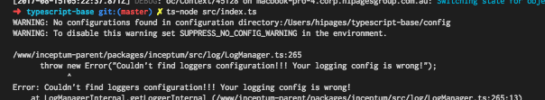

## Creating a simple rest API

In this tutorial, we will be using inceptum-swagger to create a TODO API that talks to a mysql database. 

## Setting up our app
In this tutorial, we'll be using Typescript, because types are fun. All of this should work in plain javascript as well though!
To make typescript work, we'll be just-in-time transpliling it with ts-node.

```
$ yarn global add ts-node
```

Now, lets add inceptum to our project...
```
$ yarn add inceptum
```

And use it to create our app:

```typescript
// src/index.ts
import { InceptumApp } from 'inceptum';

const app = new InceptumAppn();
app.start();
```

If you run `ts-node src/index.ts` you should see something like below.



It's complaining about not having any config, lets fix that!
## Config 

Lets create a file at `/config/default.yml`

```yml
app:
  name: My Todo App
  context:
    name: BaseContext
logging:
  streams:
    console:
      type: console
    myredis:
      type: redis
    mainLogFile:
      type: file
      path: main.log
  loggers:
    - name: ROOT
      streams:
        console: debug
```

 `ts-node src/index.ts` again... nice! Our app runs, but it doesn't actually do anything ...yet.

## Swagger And Routing

Setting up the swagger plugin is easy! We just need to import the package and tell our App to use it.
Inceptum Web will set up our express server, and SwaggerPlugin will set up our routing via our swagger file.

```typescript
// src/index.ts
import { InceptumApp, SwaggerPlugin, WebPlugin } from 'inceptum';
import * as path from 'path';

const swaggerPath = path.resolve(`${__dirname}/../config/swagger.yaml`);
const app = new Inceptum();
app.use(new WebPlugin(), new SwaggerPlugin(swaggerPath))
app.start();
```

We now need to set up our swagger file where we will define our routes. This seems pretty long, but most of it is just 
boilerplate 

```yml
# /config/swagger.yml
swagger: "2.0"
info:
  version: "0.0.1"
  title: ToDo sample application
host: localhost:10010
basePath: /
schemes:
  - http
  - https 
consumes:
  - application/json
produces:
  - application/json
paths:
  /todo/{id}:
    x-inceptum-controller: TodoController
    get:
      description: Gets one todo by id
      x-inceptum-operation: get(id)
      parameters:
       - name: id
         type: string
         required: true
         in: path
      responses:
        "200":
          description: Success
          schema:
            type: object
```

The intersting parts here are the custom attributes we've defind `x-inceptum-controller` and `x-inceptum-operation`.
The attributes are basically defining what method we are going to call on what controller, as well as what paramaters
were are going to pass to that method.

Finally, we need to let inceptum know where to find out controllers. To do this, we can add the following line to our
index.js.

```typescript
// src/index.ts
import { InceptumApp, SwaggerPlugin, WebPlugin } from 'inceptum';
import * as path from 'path';

const swaggerPath = path.resolve(`${__dirname}/../config/swagger.yaml`);
const app = new Inceptum();
app.useDirectory(path.resolve(`${__dirname}/controller`));  // <--- Register our controllers
app.use(new WebPlugin(), new SwaggerPlugin(swaggerPath));
app.start();
```

Here we are using node's built-in `path` module to point inceptum to our controllers located at `/src/controllers`

We can now write our controller!

```typescript
// src/controllers/TodoController.ts
export default class TodoController {

  async get(key, req, res) {
    return res.send({
      id: key,
      done: false
    });
  }

}

```
Now, if you start your app and go to `localhost:10100/todo/1234` in your browser you should receive the following JSON response:

```json
{
  "id": 1234,
  "done: false
}
```

Cool! But static data isn't really useful. Lets add a database!

## Adding a database 

To add a database connection to our app, all we need to do is add the following to our config.yml. Inceptum will automatically 
create add MysqlPlugin() // TODO LINK to our application. It will be registered under the name `mysqlClient` to the IoC container.

```yml
#config.yml
mysql: # Telling inceptum to add a new MysqlPlugin() to our app
  MainMysqlClient: # IoC name
    master:
      host: localhost
      port: 3306
      user: root
      password:
      database: testDb
      charset: utf8
      connectionLimit: 10
```

You'll notice that we've added a `master` conifg. We can also add a `slave` config that Inceptum will use if we want a read only
transaction, like so:

```yml
mysql:
  mysqlClient: # this is the name of the object that will be exposed in the context
    master:
      host: localhost
      port: 3306
      user: root
      password:
      database: testDb
      charset: utf8
      connectionLimit: 10
    slave:
      host: localhost
      port: 3306
      user: root
      password:
      database: testDb
      charset: utf8
      connectionLimit: 10
```

In this example both connections are pointing to the same place, but in production we can change this to point to a read only replica or user.


## Connecting everything together

To talk to our database, we're going to create a `Service` class.

```typescript
export default class TodoService {

  getTodo(id) {
    // TODO Implement me!
  }

}
```

Here, we're going to tell inceptum that we want access to the mysql client we just set up in the service we just created.
To do this, we define a static property on our class to tell inceptum what dependencies we want to be injected.


```typescript
export default class TodoService {

  static autowire = {
    mysql: 'MainMysqlClient',
  };

  getTodo(id) {
    // TODO Implement me!
  }
}

```

We can now use the client in our service like below:


```typescript
// src/service/TodoService.ts
export default class TodoService {
  mysql: any;

  static autowire = {
    mysql: 'MainMysqlClient',
  };

  async getTodo(id) {
    return this.mysql.runInTransaction(true, async (client) => {
      const [todo] = await client.query(`SELECT * FROM todos WHERE id = ?`, id);
      return todo;
    });
  }
}
```

Finally, we need to tell Inceptum that these service classes exist:

```typescript
// src/index.ts
import { InceptumApp, SwaggerPlugin, WebPlugin } from 'inceptum';
import * as path from 'path';

const swaggerPath = path.resolve(`${__dirname}/../config/swagger.yaml`);
const app = new Inceptum();
app.useDirectory(path.resolve(`${__dirname}/controller`));
app.useDirectory(path.resolve(`${__dirname}/service`)); // <--- Register our services
app.use(new WebPlugin(), new SwaggerPlugin(swaggerPath));
app.start();
```

Now, we need to wire up our service to our controller, we do this in a similar way to myself

```typescript
// src/controllers/TodoController.ts
export default class TodoController {
  service: any;

  static autowire = {
    service: 'TodoService',
  };

  async get(id, req, res) {
    const todo = await this.service.getTodo(id);
    res.send(todo);
  }
}
```

If we hit our endpoint now, you should see data straight out of your database in JSON form. Congrats! You have just created
your first REST API powered by Inceptum!